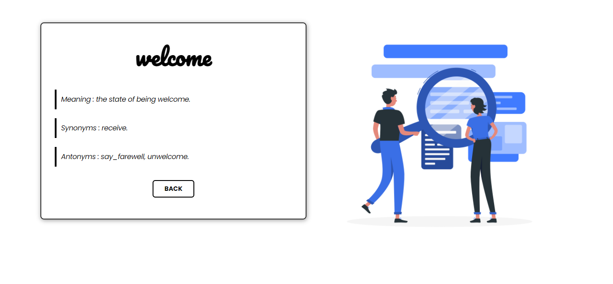
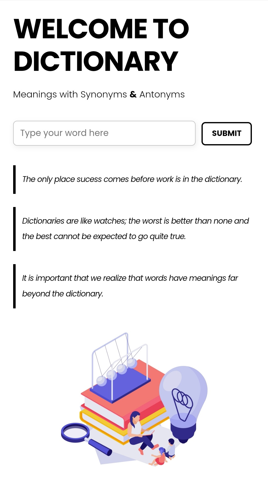

# English Dictionary WebApp

This is a Django project to create an english dictionary which provides meaning of the word along with synonyms & antonyms.

## Table of contents

  - [Overview](#overview)
    - [Links](#links)
    - [Screenshot](#screenshot)
  - [My process](#my-process)
    - [Built with](#built-with)
  - [Author](#author)

## Overview

### Links

- [GitHub repo](https://github.com/Farhaan9082/DictionaryApp)
- [Live Site URL](https://awesome-dictionary.herokuapp.com/)

### Screenshots

## My process

### Built with

- Python - Django (Framework)
- HTML & CSS
- PyDictionary (For meaning)
- NLTK - wordnet (For synonyms & antonyms)
- Heroku

## Author

[@Farhaan](https://github.com/Farhaan9082)
